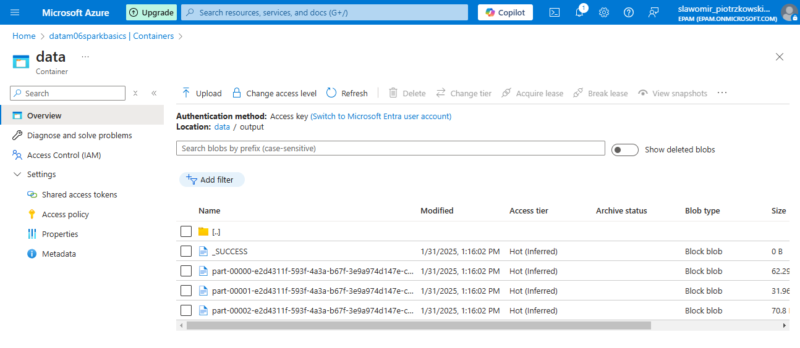

# Homework Documentation

Fully documented homework with screenshots and comments.

List of Contents:

- [1. Objectives](#1-Objectives)
- [2. Spark ETL Job](#2-Spark-ETL-Job)
- [3. Docker Container](#3-Docker-Container)
- [4. Kubernetes](#4-Kubernetes)
- [5. Job deployment](#5-Job-deployment)
- [6. Summary](#6-Summary)

## 1. Objectives

Objective of the homework was to get accustomed with the pyspark framework 

Part were
- Create spark ETL job to process data
- Create a docker container using the provisioned code from the [m06_sparkbasics_python_gcp](https://git.epam.com/epmc-bdcc/trainings/bd201/m06_sparkbasics_python_gcp) repository.
- Deploy Spark job on Kubernetes Service in Azure.

## 2. Spark ETL Job

The ETL job was supposed to do the following tasks:

- Load Hotels and Weather data
- Check hotels data on incorrect (null) values (Latitude & Longitude). For incorrect values map (Latitude & Longitude) from OpenCage Geocoding API in job on fly (Via REST API).
- Generate geohash by Latitude & Longitude using one of geohash libraries (like geohash-java) with 4-characters length in an extra column.
- Left join weather and hotels data by generated 4-characters geohash.
- Save the enriched data

The ETL job design:


#### Variables

Any sensitive information or parameters are passed to the job as environment variables. Following variables are read by the script:

- OPENCAGE_API_KEY - key for API responsible for fetching Latitude and longitude based on the address provided 
- STORAGE_ACCOUNT_NAME - Azure storage account name
- STORAGE_ACCOUNT_KEY - Azure storage account name
- HOTELS_CONTAINER - Name of the storage container holding hotels data
- WEATHER_CONTAINER - Name of the storage container holding weather data
- OUTPUT_CONTAINER- Name of the storage container to save the enriched data

Spark Session was created with additional parameters to support working with azure filesystem

```python
spark.conf.set(
        f"fs.azure.account.key.{storage_account_name}.dfs.core.windows.net",
        storage_account_key
)
```

#### Load Hotels Data

Data was loaded from the `csv` file. Since the `csv` file is unstructured, the following schema was applied for the data:

```python
    schema = StructType([
        StructField("Id", LongType(), True),
        StructField("Name", StringType(), True),
        StructField("Country", StringType(), True),
        StructField("City", StringType(), True),
        StructField("Address", StringType(), True),
        StructField("Latitude", DoubleType(), True),
        StructField("Longitude", DoubleType(), True)
    ])
```

#### Missing Data

As instructed in the homework description [OpenCage Geocoding API](https://opencagedata.com/api) was used to fill in any missing coordinates in the hotel data.

#### Load Weather Data

Weather data was loaded from the parquet files. The schema of the parquet files was as following:

| Column name | Description | Data type | Partition |
| --- | --- | --- | --- |
| lng | Longitude of a weather station | double | no |
| lat | Latitude of a weather station | double | no |
| avg_tmpr_f | Average temperature in Fahrenheit | double | no |
| avg_tmpr_c | Average temperature in Celsius | double | no |
| wthr_date | Date of observation (YYYY-MM-DD) | string | no |
| wthr_year | Year of observation (YYYY) | string | yes |
| wthr_month | Month of observation (MM) | string | yes |
| wthr_day | Day of observation (DD) | string | yes |


#### Geohash

Library pygeohash was used to generate geohash for each set of coordinates. 

#### Weather Data Aggregation

For weather data due to low precision of the geohashing, similar coordinates (close together) in this case were duplicated. Additional data transformation was performed to calculate the average temperature for each region.

#### Left Join

Left join hotels with weather data was performed. Through data was created for each hotel received weather data for each provided date.

#### Output 

Output was saved into the Parquet files in the following format:

| Column name | Data type |
| ----------- | --------- |
|geohash|string|
|Id|bigint|
|Name|string|
|Country|string|
|City|string|
|Address|string|
|Latitude|double|
|Longitude|double|
|wthr_date|string|
|avg_tmpr_f|double|
|avg_tmpr_c|double|


All provided code can be found in the `M06_SPARK_BASICS_PYTHON_AZURE/src/python/main` folder.

#### Testing

Testing was done using the pytest framework. All test scripts are located in `M06_SPARK_BASICS_PYTHON_AZURE/src/test` folder.

Example of running tests:


## 3. Docker Container

Docker container was built using docker file from the [m06_sparkbasics_python_gcp](https://git.epam.com/epmc-bdcc/trainings/bd201/m06_sparkbasics_python_gcp) repository.

Slight changes were applied to the dockerfile:

- Version of spark 3.5.4 and hadoop 3.3.4
- Using python scripts instead of an `egg` file.

After successfully building the image was tagged `m06sparkbasics:0.0.1` and was uploaded to azure repository created for the purpose of this homework:


## 4. Kubernetes

Kubernetes cluster was deployed on Azure using the provided terraform files. Slight changes were made to the file - number of nodes was increased from 1 to 2.

A storage account with a data container was provided to hold the `tf.state` terraform file.

Deployment:


Additional configuration was performed to allow kubernetes cluster to access the created container repository to use the created spark image. Cluster role and cluster role binding `yml` files were created. 

Access was granted by using az command:
```bash
az aks update --name aks-m06-westeurope --resource-group rg-m06-westeurope --attach-acr m06sparkbasicsdocker
```

## 5. Job deployment

Data was added to a separate Azure storage account: `datam06sparkbasics` into a container called `data`.

Spark job was initiated via the following spark job command:

```bash
spark-submit \
    --master k8s://https://bdccm06-irmk53xl.hcp.westeurope.azmk8s.io:443 \
    --deploy-mode cluster \
    --name sparkbasics \
    --conf spark.executor.instances=3 \
    --conf spark.kubernetes.container.image=m06sparkbasicsdocker.azurecr.io/m06sparkbasics:0.0.1 \
    --conf spark.kubernetes.authenticate.driver.serviceAccountName=spark \
    --conf spark.kubernetes.driver.request.cores=300m \
    --conf spark.kubernetes.executor.request.cores=300m \
    --conf spark.kubernetes.executorEnv.OPENCAGE_API_KEY='xxx' \
    --conf spark.kubernetes.executorEnv.STORAGE_ACCOUNT_NAME=datam06sparkbasics \
    --conf spark.kubernetes.executorEnv.STORAGE_ACCOUNT_KEY='xxx' \
    --conf spark.kubernetes.executorEnv.HOTELS_CONTAINER_URL=data \
    --conf spark.kubernetes.executorEnv.WEATHER_CONTAINER_URL=data \
    --conf spark.kubernetes.executorEnv.OUTPUT_CONTAINER_URL=data \
    --conf spark.kubernetes.driverEnv.OPENCAGE_API_KEY='xxx' \
    --conf spark.kubernetes.driverEnv.STORAGE_ACCOUNT_NAME=datam06sparkbasics \
    --conf spark.kubernetes.driverEnv.STORAGE_ACCOUNT_KEY='xxx' \
    --conf spark.kubernetes.driverEnv.HOTELS_CONTAINER_URL=data \
    --conf spark.kubernetes.driverEnv.WEATHER_CONTAINER_URL=data \
    --conf spark.kubernetes.driverEnv.OUTPUT_CONTAINER_URL=data \
    local:///opt/spark/work-dir/etl_job.py
```

__Note:__ 
  
- Certain CPU parameters were applied to the submission due to free tier limitations.
- Job was performed only for one month of data due to memory limitations.
- Secrets were passed through simply through the parameters. In the real production environment they could be passed via kubernetes config map.

The results of the processed job:

Kubernetes launched pods:


Kubernetes final result


Output data on the azure


Sample of the processed data:

|geohash|           Id|                Name|Country|         City|             Address|   Latitude|   Longitude| wthr_date|avg_tmpr_f|avg_tmpr_c|
|-------|-------------|--------------------|-------|-------------|--------------------|-----------|------------|----------|----------|----------|
|   9exv|1425929142278|City Express Irap...|     US|       Mobile|Blvd Villas De Ir...|  20.683032| -101.380828|2016-10-10|      64.5|      18.1|
|   9mur|1090921693185|Quality Inn and S...|     US|  Lake Forest|23702 Rockfield Blvd|  33.628221| -117.715975|2016-10-11|      66.5|      19.2|
|   9pzz|1563368095745|  Pelican Shores Inn|     US| Lincoln City|  2645 N W Inlet Ave|44.98465469|-124.0137872|2016-10-31|      53.4|      11.9|
|   9q4g| 343597383684|Casa Del Mar Inn ...|     US|Santa Barbara|          18 Bath St|  34.409581| -119.693387|2016-10-06|      64.6|      18.1|
|   9q4g| 498216206339|   Simpson House Inn|     US|Santa Barbara|  121 E Arrellaga St|  34.428888| -119.707704|2016-10-06|      64.6|      18.1|
|   9q4g| 481036337155|             Motel 6|     US|Santa Barbara|       3505 State St|  34.440318| -119.738091|2016-10-06|      64.6|      18.1|
|   9qh3| 781684047875|    Super 8 - Upland|     US|       Upland|       1282 W 7th St|   34.08881|  -117.67238|2016-10-10|      68.1|      20.1|
|   9qh3| 446676598784|Extended Stay Ame...|     US|      Ontario|3990 Inland Empir...|  34.068836| -117.563225|2016-10-10|      68.1|      20.1|
|   9qj0| 944892805122|Monarch of Rancho...|     US|Rancho Mirage|   34560 Bob Hope Dr|  33.798553|  -116.40588|2016-10-12|      72.8|      22.6|
|   9qj0|1116691496964|       Helios Resort|     US| Palm Springs|       280 E Mel Ave|  33.840755|  -116.54468|2016-10-12|      72.8|      22.6|
|   9qj0| 549755813888|Little Paradise H...|     US| Palm Springs|435 E Avenida Ola...|  33.802822|  -116.54269|2016-10-12|      72.8|      22.6|
|   9r0y|  42949672967|           Pizza Hut|     US|      Redding|     2055 Hilltop Dr|  40.577811| -122.357688|2016-10-05|      58.6|      14.8|
|   9r0y| 163208757251|         Economy Inn|     US|      Redding|     525 N Market St|  40.599105| -122.384362|2016-10-05|      58.6|      14.8|
|   9r0y|1443109011462|The Desmond House...|     US|      Redding|   1449 Riverside Dr|  40.590188| -122.394149|2016-10-05|      58.6|      14.8|
|   9r0y| 489626271748|Tiffany House Bed...|     US|      Redding|     1510 Barbara Rd|   40.60182| -122.384637|2016-10-05|      58.6|      14.8|
|   9r13|1245540515840|Americas Best Val...|     US|        Chico|     740 Broadway St|   39.72602|  -121.83713|2016-10-15|      61.4|      16.3|
|   9r18|1434519076866|          Sunset Inn|     US|     Oroville|1835 Feather Rive...|  39.504005| -121.569869|2016-10-27|      61.2|      16.2|
|   9rm8| 730144440321|Townplace Suites ...|     US|         Elko|   2620 Jennings Way|  40.831062|  -115.79993|2016-10-25|      48.7|       9.3|
|   9rm8| 996432412678|         Rodeway Inn|     US|         Elko|        736 Idaho St|   40.83441| -115.760897|2016-10-25|      48.7|       9.3|
|   9rm8| 970662608897|     Super 8 Elko Nv|     US|         Elko|       1755 Idaho St|  40.843764| -115.751013|2016-10-25|      48.7|       9.3|

## 6. Summary

The primary objective of the homework was to get accustomed to the PySpark framework and perform various tasks related to handling and processing data. The homework was structured into several parts consisting of creating a Spark ETL job, setting up a Docker container, and deploying the Spark job on Kubernetes Service in Azure.

In the Spark ETL job, tasks included loading hotel and weather data, handling missing values using the OpenCage Geocoding API, generating geohash for location data, performing a left join on hotel and weather data based on geohash, and saving the enriched data. All sensitive information was handled securely through environmental variables.

A Docker container was configured with specific versions of Spark and Hadoop alongside using Python scripts. The image was built and successfully pushed to an Azure repository.

For Kubernetes deployment, a cluster was set up in Azure with adjusted configurations to meet the requirements. The Spark job was deployed using the k8s environment and managed to output processed data as desired, despite limitations encountered like memory and computation restrictions.

Overall, the successful execution of the Spark job in this complex, distributed environment showcased the capability to handle, process, and analyze large datasets efficiently using Spark, Docker, and Kubernetes in a cloud setting, while adhering to best practices in security and data handling.